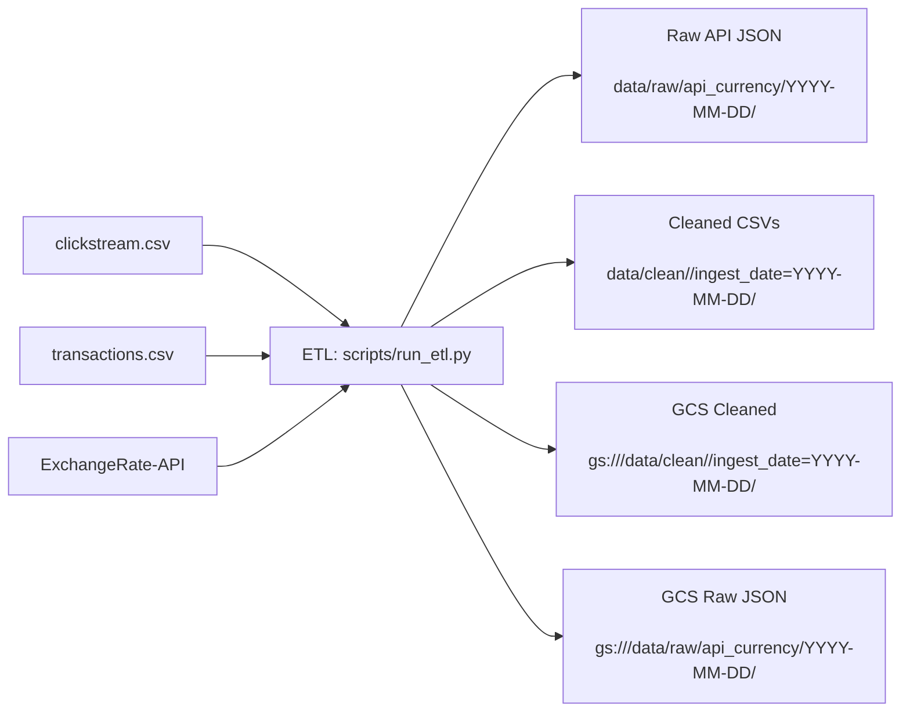
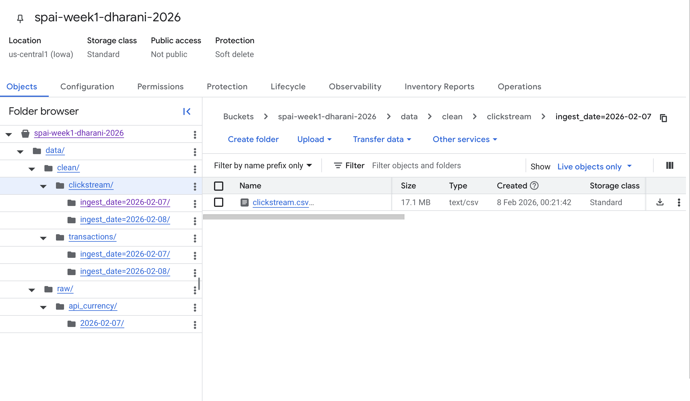
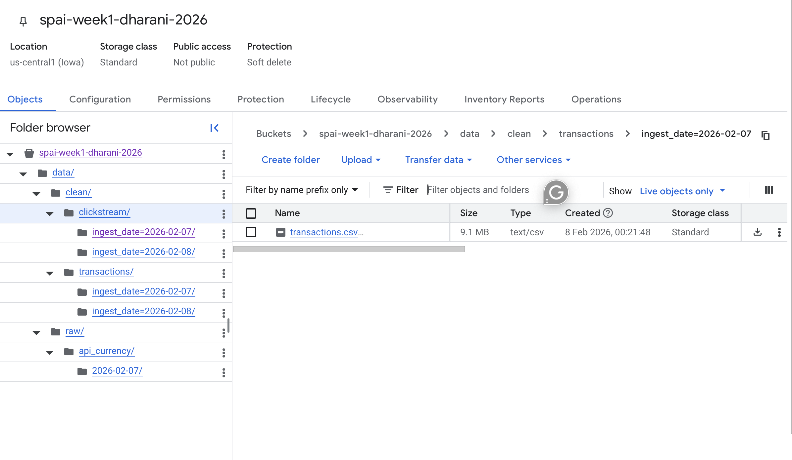
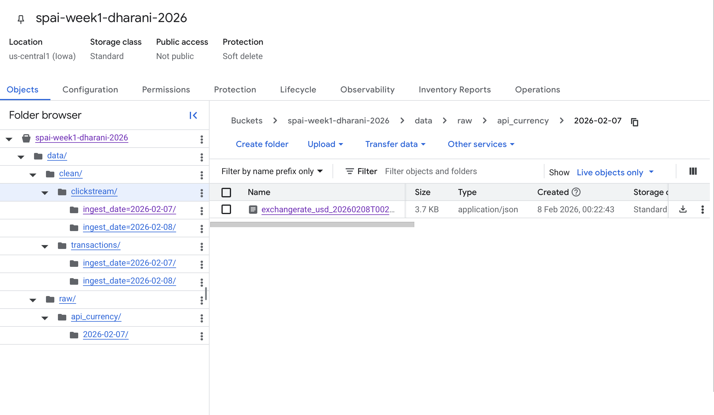
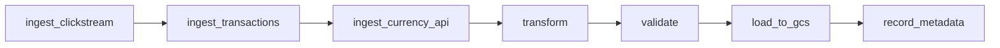

# StoryPoints AI Week 1 – Data Engineering

## Overview
This repository contains an end-to-end ETL pipeline that:
- Extracts clickstream and transactions data from CSVs in chunks.
- Fetches real-time USD exchange rates from ExchangeRate-API.
- Standardizes schema, converts timestamps to UTC, deduplicates, and enriches transactions with `amount_in_usd`.
- Loads cleaned datasets into `data/clean/<dataset>/ingest_date=YYYY-MM-DD/` and GCS with the same path prefix.
- Stores raw API JSON responses at `data/raw/api_currency/YYYY-MM-DD/` (local + optional GCS upload).

## Dataset Exploration (Schema, Nulls, Duplicates)
All profiling was run locally with `scripts/profile_datasets.py`.

### `clickstream.csv`
- Rows: `200000`
- Columns: `user_id`, `session_id`, `page_url`, `click_time`, `device`, `location`
- Dtypes: `user_id` (int64), others (string/object)
- Nulls: `0` for all columns
- Duplicate rows: `0`

### `transactions.csv`
- Rows: `100000`
- Columns: `txn_id`, `user_id`, `amount`, `currency`, `txn_time`
- Dtypes: `txn_id` (string/object), `user_id` (int64), `amount` (float64), `currency` (string/object), `txn_time` (string/object)
- Nulls: `0` for all columns
- Duplicate rows: `0`
- Duplicate `txn_id`: `0`

## Transformations Applied
- Column names standardized to lowercase snake_case.
- `click_time` and `txn_time` converted to UTC ISO format.
- Deduplication (`clickstream`: full-row; `transactions`: `txn_id`).
- Transactions enriched with `amount_in_usd` using USD-based conversion rates (formula: `amount_in_usd = amount / conversion_rate[currency]`).

## Architecture Diagram


## How To Run
### 1. Create virtual environment
```bash
python3 -m venv .venv
. .venv/bin/activate
pip install -r requirements.txt
```

### 2. Set environment variables
The ETL auto-loads a `.env` file from the repo root (if present).
```bash
export GCP_PROJECT_ID=storypoints-week1-dharani
export GCS_BUCKET=spai-week1-dharani-2026
export EXCHANGE_API_KEY=your_key_here
export CHUNK_SIZE=50000
export CLICKSTREAM_PATH=./clickstream.csv
export TRANSACTIONS_PATH=./transactions.csv
export GOOGLE_APPLICATION_CREDENTIALS=/path/to/service_account.json
```

### 3. Run ETL
```bash
.venv/bin/python scripts/run_etl.py
```
Optional flags:
- `--chunk-size 50000`
- `--ingest-date YYYY-MM-DD`
- `--skip-api` (skips API call, leaves `amount_in_usd` null)

## Outputs
- Local cleaned file: `data/clean/clickstream/ingest_date=YYYY-MM-DD/clickstream.csv`
- Local cleaned file: `data/clean/transactions/ingest_date=YYYY-MM-DD/transactions.csv`
- Raw API JSON: `data/raw/api_currency/YYYY-MM-DD/exchangerate_usd_<timestamp>.json`
- GCS (if configured): `gs://<bucket>/data/clean/clickstream/ingest_date=YYYY-MM-DD/clickstream.csv`
- GCS (if configured): `gs://<bucket>/data/clean/transactions/ingest_date=YYYY-MM-DD/transactions.csv`
- GCS (if configured): `gs://<bucket>/data/raw/api_currency/YYYY-MM-DD/exchangerate_usd_<timestamp>.json`

## Logging & Alerts
The ETL logs:
- Record counts per dataset
- Number of deduplicated rows
- Warnings for missing input files or API failures

A sample run log (captured on 2026-02-07 with `--skip-api`) is saved at `docs/run_log_sample.txt`.

## Assumptions
- ExchangeRate-API provides USD-based rates (`1 USD = rate[currency]`).
- All timestamps are parsed and normalized to UTC.
- GCS upload uses Application Default Credentials or a service account key.

## Screenshots




## Week 2 – Composer Orchestration
The Week 2 pipeline orchestrates ingestion, transformation, validation, and loading in Cloud Composer (Airflow).

### DAG Flow

Place the Composer DAG screenshot at `docs/screenshots/week2_dag.png`.



### Validation Rules
- Clickstream: required columns are non-null.
- Transactions: required columns are non-null.
- Transactions: `amount` must be positive.
- Transactions: `currency` must be in the ExchangeRate-API payload (or `WEEK2_VALID_CURRENCY_CODES`).

### Metadata Tracking
Metadata is appended to `week2_orchestration/metadata/run_log.csv` (and optionally uploaded to GCS).
Tracked fields include rows ingested, transformed, loaded, validation status, and UTC timestamps.

### Monitoring & Alerts
Failures trigger Airflow email alerts (if configured) and are logged to `week2_orchestration/metadata/alerts.log`.
Optional Slack alerts use a webhook URL from configuration.

### Configuration (Airflow Variables or Env Vars)
| Purpose | Airflow Variable | Environment Variable |
| --- | --- | --- |
| Clickstream input | `week2_clickstream_path` | `WEEK2_CLICKSTREAM_PATH` or `CLICKSTREAM_PATH` |
| Transactions input | `week2_transactions_path` | `WEEK2_TRANSACTIONS_PATH` or `TRANSACTIONS_PATH` |
| Raw data directory | `week2_raw_dir` | `WEEK2_RAW_DIR` |
| Clean data directory | `week2_clean_dir` | `WEEK2_CLEAN_DIR` |
| Metadata directory | `week2_metadata_dir` | `WEEK2_METADATA_DIR` |
| Exchange API key | `week2_exchange_api_key` | `WEEK2_EXCHANGE_API_KEY` or `EXCHANGE_API_KEY` |
| Chunk size | `week2_chunk_size` | `WEEK2_CHUNK_SIZE` or `CHUNK_SIZE` |
| GCS bucket | `week2_gcs_bucket` | `WEEK2_GCS_BUCKET` or `GCS_BUCKET` |
| GCP project | `week2_gcp_project` | `WEEK2_GCP_PROJECT` or `GCP_PROJECT_ID` |
| Alert emails | `week2_alert_emails` | `WEEK2_ALERT_EMAILS` or `ALERT_EMAILS` |
| Slack webhook | `week2_slack_webhook` | `WEEK2_SLACK_WEBHOOK` or `SLACK_WEBHOOK_URL` |
| Valid currency codes | `week2_valid_currency_codes` | `WEEK2_VALID_CURRENCY_CODES` |
| Required clickstream cols | `week2_clickstream_required_columns` | `WEEK2_CLICKSTREAM_REQUIRED_COLUMNS` |
| Required transaction cols | `week2_transactions_required_columns` | `WEEK2_TRANSACTIONS_REQUIRED_COLUMNS` |
| DAG schedule | `week2_schedule` | `WEEK2_SCHEDULE` |
| DAG start date | `week2_start_date` | `WEEK2_START_DATE` |
| Task retries | `week2_retries` | `WEEK2_RETRIES` |
| Retry delay (minutes) | `week2_retry_delay_min` | `WEEK2_RETRY_DELAY_MIN` |
| Alerts log path | `week2_alerts_log_path` | `WEEK2_ALERTS_LOG_PATH` |

### Deployment Notes
Copy `week2_orchestration/` into your Composer `dags/` bucket and ensure the Week 1 `scripts/` folder is available on the DAGs PYTHONPATH (or vendored into `dags/`), since the DAG imports Week 1 helpers.
