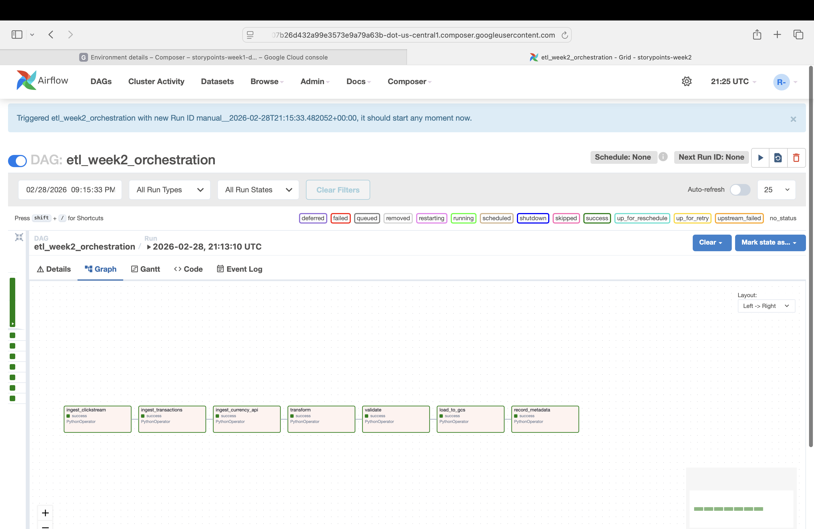
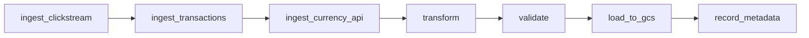

# Week 2 – Composer Orchestration

**Overview**
This Week 2 pipeline operationalizes the Week 1 ETL in Cloud Composer (Airflow). The DAG orchestrates ingestion, transformation, validation, loading to GCS, and metadata logging with alerts on failures.

**DAG Flow**

**Validation Rules**
- Clickstream: required columns are non-null.
- Transactions: required columns are non-null.
- Transactions: `amount` must be positive.
- Transactions: `currency` must be in the ExchangeRate-API payload (or `WEEK2_VALID_CURRENCY_CODES`).

**Metadata Tracking**
Metadata is appended to `week2_orchestration/metadata/run_log.csv` and uploaded to GCS when configured. Tracked fields include rows ingested, transformed, loaded, validation status, and UTC timestamps.

**Monitoring & Alerts**
Failures trigger Airflow email alerts (if configured) and are logged to `week2_orchestration/metadata/alerts.log`. Optional Slack alerts use a webhook URL.

**Configuration (Airflow Variables or Env Vars)**
| Purpose | Airflow Variable | Environment Variable |
| --- | --- | --- |
| Clickstream input | `week2_clickstream_path` | `WEEK2_CLICKSTREAM_PATH` or `CLICKSTREAM_PATH` |
| Transactions input | `week2_transactions_path` | `WEEK2_TRANSACTIONS_PATH` or `TRANSACTIONS_PATH` |
| Raw data directory | `week2_raw_dir` | `WEEK2_RAW_DIR` |
| Clean data directory | `week2_clean_dir` | `WEEK2_CLEAN_DIR` |
| Metadata directory | `week2_metadata_dir` | `WEEK2_METADATA_DIR` |
| Exchange API key | `week2_exchange_api_key` | `WEEK2_EXCHANGE_API_KEY` or `EXCHANGE_API_KEY` |
| Chunk size | `week2_chunk_size` | `WEEK2_CHUNK_SIZE` or `CHUNK_SIZE` |
| GCS bucket | `week2_gcs_bucket` | `WEEK2_GCS_BUCKET` or `GCS_BUCKET` |
| GCP project | `week2_gcp_project` | `WEEK2_GCP_PROJECT` or `GCP_PROJECT_ID` |
| Alert emails | `week2_alert_emails` | `WEEK2_ALERT_EMAILS` or `ALERT_EMAILS` |
| Slack webhook | `week2_slack_webhook` | `WEEK2_SLACK_WEBHOOK` or `SLACK_WEBHOOK_URL` |
| Valid currency codes | `week2_valid_currency_codes` | `WEEK2_VALID_CURRENCY_CODES` |
| Required clickstream cols | `week2_clickstream_required_columns` | `WEEK2_CLICKSTREAM_REQUIRED_COLUMNS` |
| Required transaction cols | `week2_transactions_required_columns` | `WEEK2_TRANSACTIONS_REQUIRED_COLUMNS` |
| DAG schedule | `week2_schedule` | `WEEK2_SCHEDULE` |
| DAG start date | `week2_start_date` | `WEEK2_START_DATE` |
| Task retries | `week2_retries` | `WEEK2_RETRIES` |
| Retry delay (minutes) | `week2_retry_delay_min` | `WEEK2_RETRY_DELAY_MIN` |
| Alerts log path | `week2_alerts_log_path` | `WEEK2_ALERTS_LOG_PATH` |

**Composer Setup (Summary)**
- Create a Composer environment in your GCP project.
- Upload `week2_orchestration/` and `scripts/` into the Composer `dags/` bucket.
- Install PyPI packages: `pandas`, `requests`, `google-cloud-storage`.

**Run the DAG**
1. Upload inputs to the Composer bucket, for example:
   - `/home/airflow/gcs/data/clickstream.csv`
   - `/home/airflow/gcs/data/transactions.csv`
2. Set the Airflow Variables listed above.
3. Trigger the DAG and monitor the run in the Airflow UI.

**Outputs**
- Cleaned data: `/home/airflow/gcs/data/week2/clean/<dataset>/ingest_date=YYYY-MM-DD/<dataset>.csv`
- Raw API JSON: `/home/airflow/gcs/data/week2/raw/api_currency/YYYY-MM-DD/*.json`
- Metadata: `/home/airflow/gcs/data/week2/metadata/run_log.csv`
- Alerts: `/home/airflow/gcs/data/week2/metadata/alerts.log`

**Notes**
- All configs are externalized via Airflow Variables or environment variables.
- The DAG is designed to be idempotent and uses chunked ingestion.
